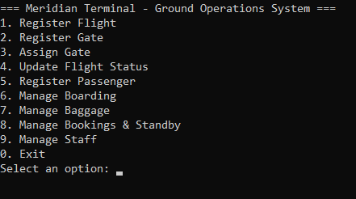
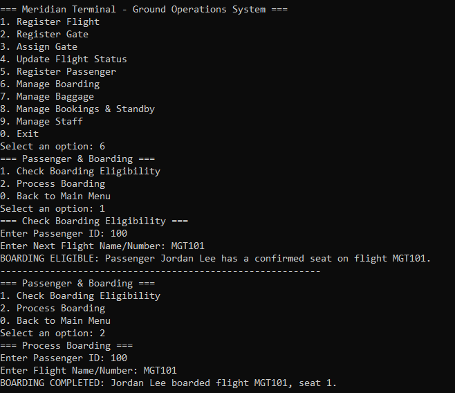

# Meridian Ground Operations Management System

A .NET console application that models airport ground operations across flights, gates, passengers, bookings, standby queues, boarding, baggage, and staff assignments.

## Features

- Domestic and international flight registration
- Gate availability, compatibility, and overlap validation
- Passenger profiles, including transit and reduced-mobility categories
- Confirmed-seat and FIFO standby booking workflows
- Booking cancellation with automatic standby promotion
- Boarding eligibility and processing rules
- Baggage registration and cumulative weight limits
- Gate-agent and baggage-staff assignments with duty-hour limits
- Seeded data for an immediate end-to-end demonstration
- Friendly domain errors through a custom exception

## Screenshots

### Main menu



### Boarding workflow



## Technology and design

- C# and .NET 10
- Object-oriented models and specialized staff types
- Lists, queues, validation services, and custom exceptions
- In-memory data for a self-contained demonstration

## Run

```powershell
dotnet restore
dotnet run
```

Or open `MeridianGroundOperationsManagementSystem.slnx` in a compatible Visual Studio version.

## Seeded demonstration data

The app starts with:

- Gate `A1`
- Departing flight `MGT101`, scheduled about two hours after startup, with three seats
- Passenger `100`, **Jordan Lee**
- One confirmed booking for Jordan Lee on `MGT101`
- Gate agent `10`, **Sam Carter**, assigned to gate `A1` for four hours

This lets you immediately open the booking, boarding, baggage, and staff menus. New dates are calculated at startup, so the flight does not become stale in the repository.

## Suggested workflow

1. Review the standby list for `MGT101`.
2. Register additional passengers and book all remaining seats.
3. Add another passenger to demonstrate standby.
4. Cancel a confirmed booking and observe standby promotion.
5. Register baggage and view cumulative weight.
6. Update the flight to `Boarding` and process a passenger.

## Build validation

```powershell
dotnet build
```

## Limitations

All data is in memory and resets when the app exits. The project does not include authentication, persistent storage, multi-user concurrency, or an automated test project.

